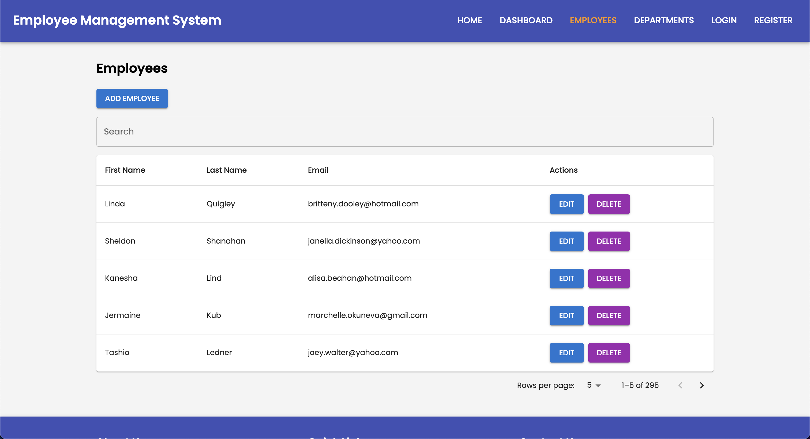
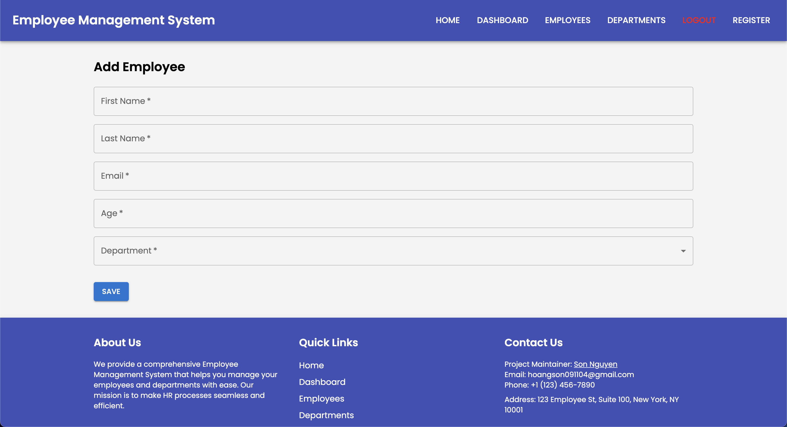
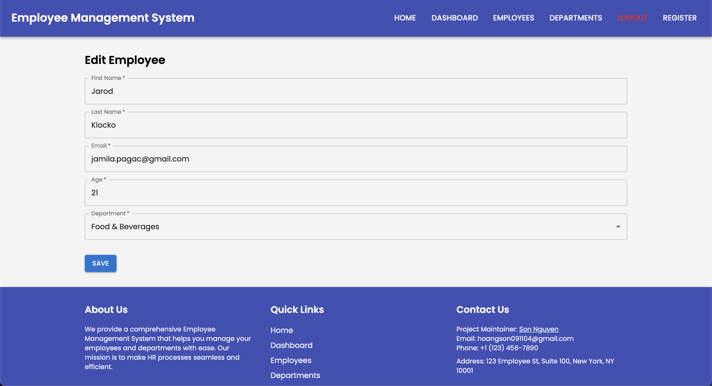

# CDA_ECF2_React_Docker

## Contexte pédagogique
Ce projet est réalisé dans le cadre de l’**ECF – Concepteur Développeur d’Applications**.  
Il s’agit d’une application de **gestion des employés** avec un frontend en React, un backend en Spring Boot, et une containerisation via Docker.

---

## Objectifs de l’ECF
- Développer l’interface frontend pour la gestion des employés (liste, ajout, modification).  
- Finaliser la containerisation complète avec Docker (frontend, backend, bases de données MySQL et MongoDB).  
- Documenter et comprendre l’architecture de l’application.

---

## Structure du projet

CDA_ECF2_React_Docker/
├─ backend/ # Projet Spring Boot pour le backend
│ ├─ src/
│ ├─ pom.xml
│ └─ Dockerfile
├─ frontend/ # Projet React pour le frontend
│ ├─ src/
│ ├─ public/
│ ├─ package.json
│ └─ Dockerfile
├─ docker-compose.yml # Orchestration des services
├─ docs/
│ └─ architecture.md # Restitution d’architecture
├─ img/ # Captures d'écran / maquettes
│ ├─ employees-page.png
│ ├─ add-employee.png
│ └─ edit-employee.png
└─ README.md


---

## Maquettes

### Page liste des employés


### Ajouter un employé


### Modifier un employé


---

## Technologies utilisées
- **Frontend** : React, CSS  
- **Backend** : Spring Boot, Java 17, Maven  
- **Bases de données** : MySQL, MongoDB  
- **Containerisation** : Docker, Docker Compose  

---

## Lancer le projet

1. Cloner le dépôt :

```bash
git clone git@github.com:fatah0003/CDA_ECF2_React_Docker.git
cd CDA_ECF2_React_Docker
```


---

## Maquettes

### Page liste des employés


### Ajouter un employé


### Modifier un employé


---

## Technologies utilisées
- **Frontend** : React, CSS  
- **Backend** : Spring Boot, Java 17, Maven  
- **Bases de données** : MySQL, MongoDB  
- **Containerisation** : Docker, Docker Compose  

---

## Lancer le projet

1. Cloner le dépôt :

```bash
git clone git@github.com:fatah0003/CDA_ECF2_React_Docker.git
cd CDA_ECF2_React_Docker
```
2. Construire et lancer tous les services avec Docker Compose :
docker-compose up --build

3. Accéder aux services :

Frontend : http://localhost:3000

Backend : http://localhost:8080

Communication entre services

Frontend → Backend : via http://localhost:8080/api/...

Backend → MySQL : via le service mysql défini dans Docker Compose

Backend → MongoDB : via le service mongodb défini dans Docker Compose

Tous les services communiquent grâce au réseau interne Docker. Les ports externes permettent l’accès depuis le navigateur ou Postman.

Docker et containerisation

Frontend Dockerfile : construit l’app React, copie le build dans une image Nginx pour le servir.

Backend Dockerfile : compile le projet Maven, crée un JAR exécutable avec Spring Boot.

docker-compose.yml : définit tous les services et les lie entre eux, avec des volumes pour les bases de données et des ports exposés.

Composants principaux React

EmployeeList : affiche la liste des employés avec leur nom, email, âge et département.

EmployeeForm : formulaire pour ajouter ou modifier un employé.

App : gestion de la navigation entre les pages via react-router-dom.

Flux des données

Le frontend envoie des requêtes HTTP au backend pour obtenir ou modifier des employés.

Le backend traite la requête, interagit avec MySQL et renvoie le résultat en JSON.

Le frontend met à jour l’interface selon la réponse.